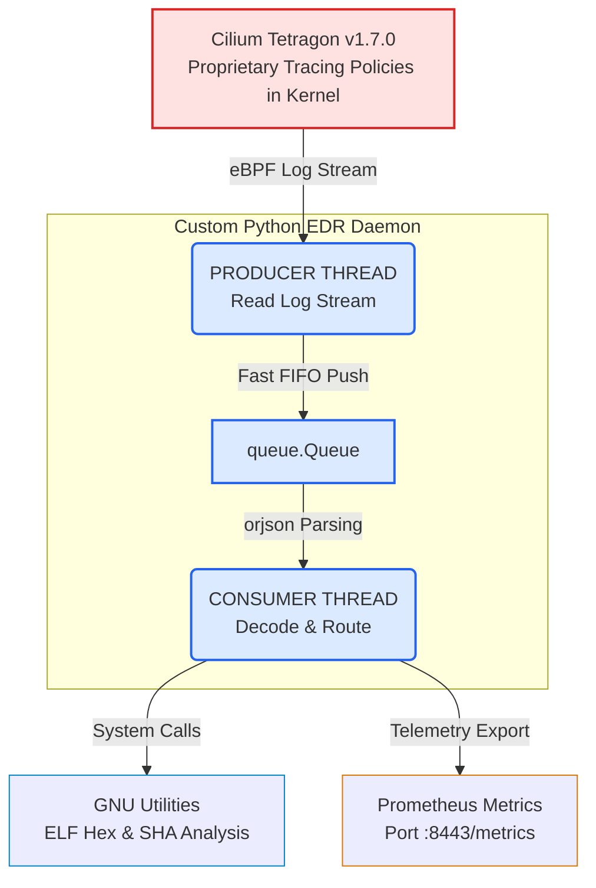

# Custom Multi-Threaded EDR Platform (Tetragon eBPF + Python Daemon)


An advanced propietary Endpoint Detection and Response (EDR) system. The application monitors OS kernel activity in real time via eBPF, analyzes executed binaries using native GNU utilises, and exports live security metrics to Prometheus.


</aside>

## CRITICAL WARNING: Self-Defense Mechanism & PID Loop

The system implements a **proprietary self-defense technology** engineered directly into the Python daemon. Its primary purpose is to protect the EDR from being maliciously terminated (e.g., by malware evesion techniques).

### The "Ghost PID" Phenomenon
* **The Issue:** If you attempt to initialize the daemon **without a valid `prometheus.yml` file**, the consumer thread will throw a critical configuration exception. Our custom supervisor immediately triggers a sub-millisecond crash-loop respawn procedure via double-forking.
* **The Consequence:** The process evades termination by changing its PID so rapidly that traditional user-space tools (like `kill -9`) become completely ineffective. Intercepting the process via terminal becomes impossible, which might ultimately forcea **hard hardware reset (pulling the power plug)**.

### How to Safely Manage the Process
* **Pre-requisite:** Always ensurethat `prometheus.yml` is present in the project's root directory before any execution attempts.
* **Proper Shutdown:** The system deliberately ignores standard termination signals from the terminal. To safety stop the EDR  and unmount the eBPF tracing policies, the built-in control flag  must be used:
  ```bash
  sudo python3 genius_analysis.py
  ```

---

## Architecture & Core Technologies

The system is designed for maximum throughput and zero packet drop, leveraging and asynchronous multi-threaded architecture in Python.



### 1. Kernel Core: Cilium Tetragon (v1.7.0+)
The EDR bypasses user-space polling by hooking directly into the Linux Kernel using **eBPF** (extended Berkeley Filter) technology **TracingPolicies** filter system events at the source, delivering a clean stream of security-relevant logs (such as memory and privililege escalation).

### 2. Producer-Consumer Pattern (`threading` + `queue`)
To prevent log dropped events during massive system activity spikes (bursts):
* **Producer Thread:** Solely responsible for rapidly reading the raw stream from Tetragon andpushing it into a thread-safe FIFO `queue.Queue`.
* **Consumer Thread:** Pulls data chunks from the queue, decodesthem, and passes them to heavy analytics, completely offloading the listener thread.

### 3. Ultra-Fast Parsing: `orjson`
Instead of using the standard Python JSON library, the system processes data using `orjson` (a blazing-fast, Rust-based JSON parser). This allows the application to handle tens of thousands of kernel events per second with minimal CPU and RAM overhead.

### 4. GNU Tools & Cryptography: ELF Executable SHA Hex Analysis 
Upon detecting a new file execution event (**ELF** format), the sytem extracts its structure, HEX headers, and section details using native **GNU binary utilities**. Concurrently, cryptographic **SHA** checksums are generated via optimized system-level utilities to match signature databases. Relying on the native **GNU toolchain** guarantees maximum stability, low footprint, and compatibility across Linux environments without requiring external GPU hardware dependencies.

### 5. Telemetry: Prometheus Metrics
All classified anomalies and internal EDR performance metrics aggregated and exposed on a dedicated server port, fully compatible with the Prometheus monitoring ecosystem. Prometheus communicates using encrypted **TLS (Transport Layer Security)** to ensure the confidentally and integrity of trasmitted data.

## Tracing Policies

### Phase 1 — Network policy

**What I monitor:**

- `tcp_v4_connect` and `tcp_v6_connect` (TCP connection attempts)
- `tcp_close` with `matchAction: Post` (connection close)

**What I extract:**

- `saddr`, `sport`, `daddr`, `dport`
- process context: `pid`, `binary`

### Phase 2 — Process policy

**What I monitor:**

- `do_open_execat` and the `begin_new_exec` execution path
- additionally, exec events with `matchAction: Post` to reliably observe the “new process image”

**Goal:** reliably capture when and what program was executed, so it can be correlated with network activity.

### Phase 3 — File integrity policy

**What I monitor:**

- `fd_install` with `matchAction: Post`
- a **Prefix** filter for selected installation paths

**Goal:** detect and record artifacts that appear in important locations (e.g., binaries, libraries, executable files).


## Tech stack

- Linux Arch
- Kernel 7.0+
- eBPF
- Tetragon v1.7.0+
- analysis script (Python 3.14.5)
